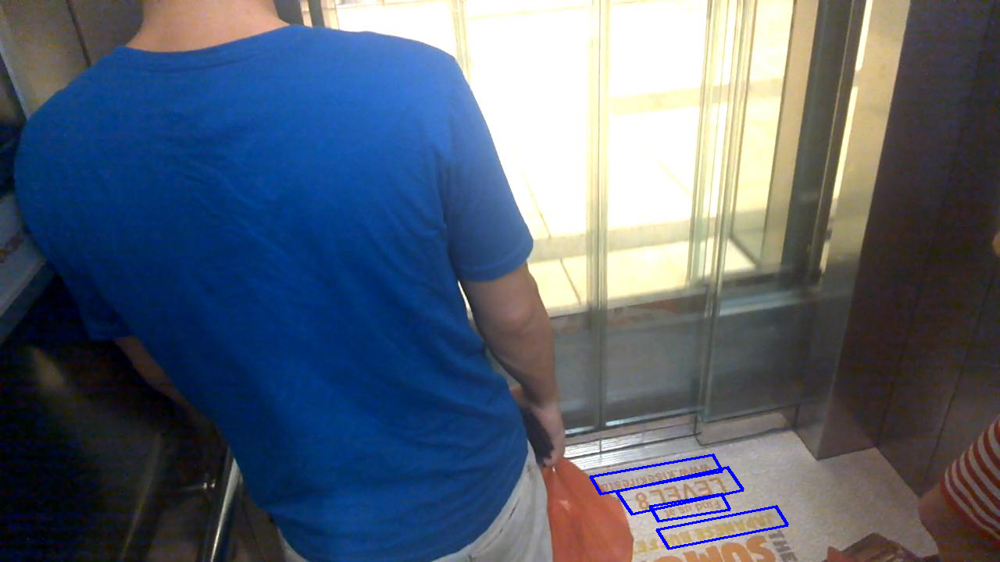
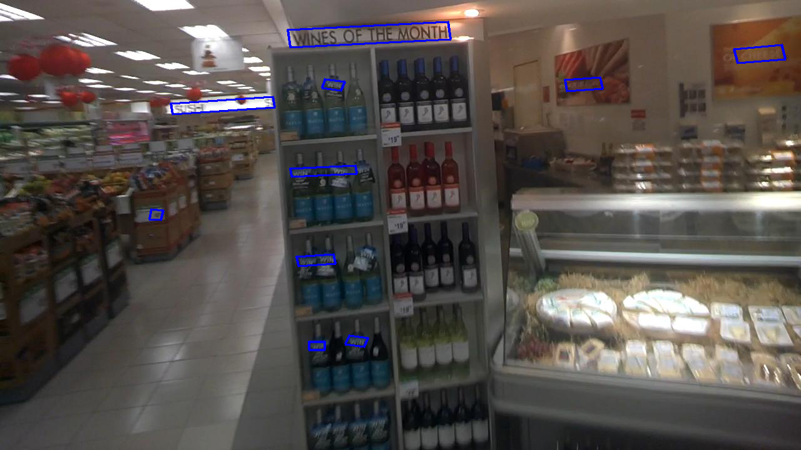
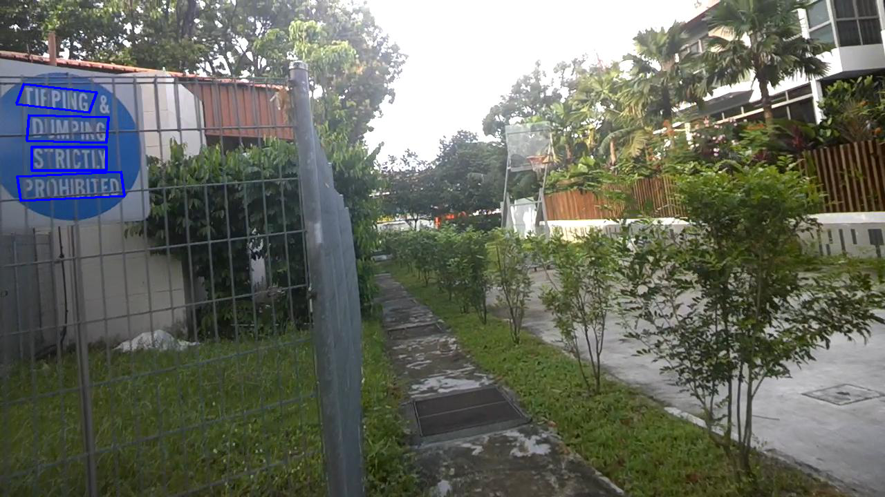
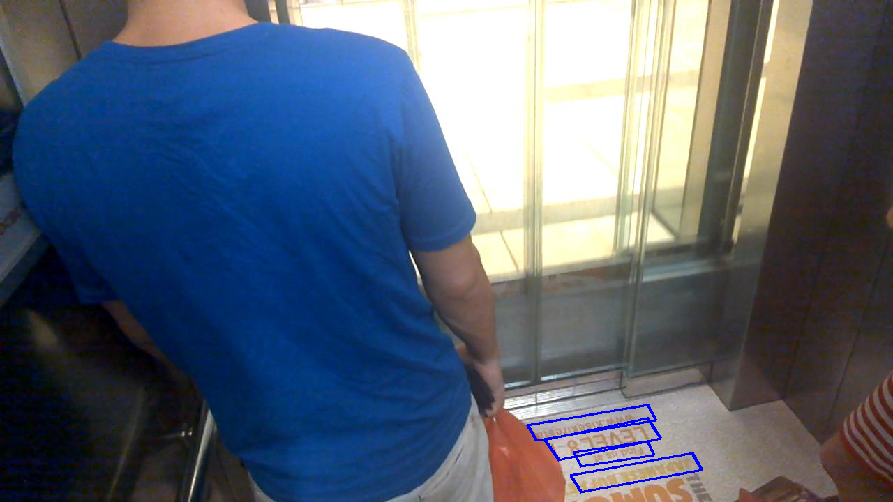
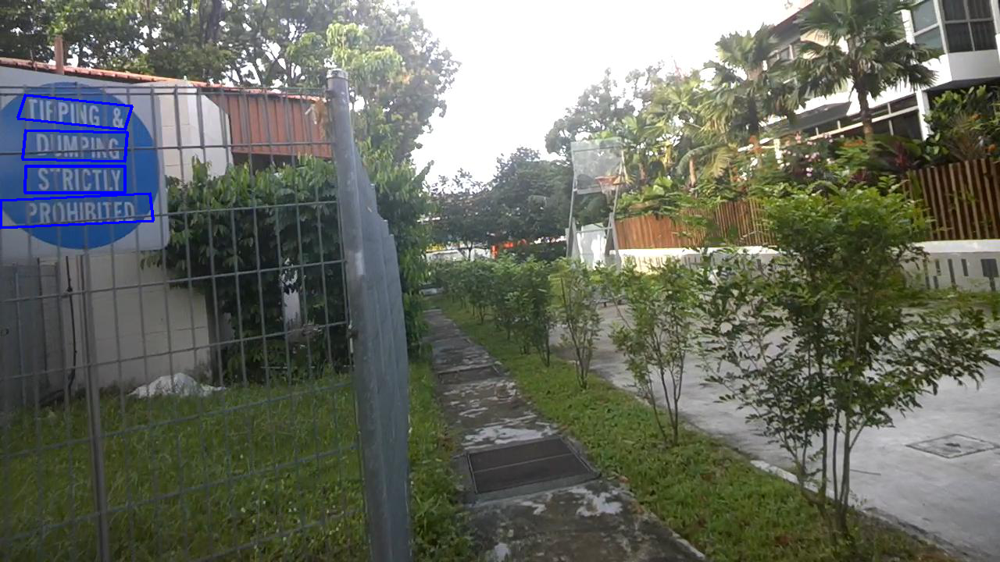

# 1 Data Preparation  
## 1.1 data directory  
train_image_dir  
&nbsp;&nbsp;&nbsp;&nbsp;img1.jpg  
&nbsp;&nbsp;&nbsp;&nbsp;img2.jpg  
&nbsp;&nbsp;&nbsp;&nbsp;......  

train_label_dir  
&nbsp;&nbsp;&nbsp;&nbsp;gt_img1.txt  
&nbsp;&nbsp;&nbsp;&nbsp;gt_img2.txt  
&nbsp;&nbsp;&nbsp;&nbsp;......  

valid_image_dir  
&nbsp;&nbsp;&nbsp;&nbsp;img3.jpg  
&nbsp;&nbsp;&nbsp;&nbsp;img4.jpg  
&nbsp;&nbsp;&nbsp;&nbsp;......  

valid_label_dir  
&nbsp;&nbsp;&nbsp;&nbsp;gt_img3.txt  
&nbsp;&nbsp;&nbsp;&nbsp;gt_img4.txt  
&nbsp;&nbsp;&nbsp;&nbsp;...... 

## 1.2 example of label file  
The format of each line of the gt_xxx.txt file is as follows:  
```
x1,y1,x2,y2,x3,y3,x4,y4,text_content
```
same as the format of ICDAR_2015  
# 2 Train:
## 2.1 set parameters of training in train.py file  
    CUDA_VISIBLE_DEVICES: the gpu used in training, like "0,1"  
    img_size: image size like (H, W)  
    backbone_type: "resnet18", "resnet34" or "resnet50", specify the backbone of model  
    epoch: training epoch  
    anchor batch size: how many anchors selected from one image  
    image batch size: how many images send to model every training step  
    lr: initial learning rate  
    lr_de_rate: lr reduce rate, new_lr = lr_de_rate * old_lr  
    patience: number of epochs with no improvement after which learning rate will be reduced  
    weight_decay: weight decay, parameter weight_decay of pytorch optimizer  
    lamda_1: regression loss weight  
    lamda_2: side refine loss weight  
    print_step: one loss information print every print_step  
    anchor_count: anchor count of every point  
    train_side_ref: True will training the side refine branch, False will not  
    train_img_dir: train image dir  
    valid_img_dir: validation image dir  
    train_label_dir: train label dir  
    valid_label_dir: validation label dir  
    negative_anchor_iou_thresh: iou threshold, to define a negative anchor  
    side_ref_dist_thresh: those anchors that are less than side_ref_dist_thresh pixels from the text edge are selected for side refine task training  
    num_workers: number of thread for data loading  
    
## 2.2 run train.py file
```
python train.py
```
due to limited hardware resources, I only used 37 images from IDCAR_2015 for training

# 3 Predict  
## 3.1 set the parameter of text line connector in TextLineCfg class in text_line.py file  
    TEXT_PROPOSALS_WIDTH: anchor width, use default 16 pixel, don't modify it  
    MAX_HORIZONTAL_GAP: the maxmum x distance that group two text proposals become a pair  
    MIN_V_OVERLAPS: mininum y overlap that group two text proposals become a pair proposals  
    MIN_SIZE_SIM: minimum height shape similarity of tow text proposal in a pair  
    USE_SIDE_REFINE: True will use the side refine when generate the text line bounding box, False will not  
## 3.2 set the parameter of prediction in predict.py file  
    anchor_count: anchor count, should same with anchor_count parameter of training config  
    backbone_type: "resnet18","resnet34" or "resnet50", should be same as the backbone_type parameter of train.py  
    img_size: image size like (H, W), should be same as img_size parameter of train.py  
    use_best_model: True will use the model which has the best performance on validation set, False will use the last epoch model  
    cls_score_thresh: score thresh for text or no-text  
    nms_iou_thresh: nms iou threshold value  
    result_output_dir: predict result save dir  
    is_draw_proposals: True will draw fine-scale text proposals on result, False will not  
    is_draw_textline_bbox: True will draw text line bounding box, False will not  
    image_pth: image path for prediction, a file path or a directory path  
## 3.3 run predict.py file  
```
python predict.py
```

# 4 Result  
## 4.1 with side refine  
<p float="left">
  
   
  
</p>  

## 4.2 without side refine  
<p float="left">
  
   
  
</p>
